# 🎮 SteamServerUI Organization

**The Ultimate Steam Game Server Management Platform**

---

## 🚀 From Stationeers to Steam: The Great Servervolution

Once upon a time, [@JacksonTheMaster](https://github.com/JacksonTheMaster) built **SteamServerUI** (SSUI), a sleek, retro-themed UI to tame the wild beast that a Stationeers dedicated server is. It was glorious—automatic SteamCMD setups, one-click controls, Discord bots, and a backup system smarter than your average space engineer. 

But then, [@mitoskalandiel](https://github.com/mitoskalandiel) dropped a galaxy-sized idea: *Why stop at Stationeers?* Why not make SSUI the ultimate overlord of **any** Steam server? 

And so, the **SteamServerUI Organization** was born, leading the charge to generalize the beautiful chaos of server management across the entire Steam ecosystem.

---

## 🌟 The Platform Evolution

### 🎯 **SteamServerUI v6** - The Universal Platform
The shiny, in-development evolution designed to run **any** Steam game server that can be wrangled with a `runfile`. From **Satisfactory** to **Project Zomboid**, **Valheim** to **Counter-Strike 2** – if SteamCMD can download it, SteamServerUI can manage it.

**Status:** 🚧 *Active Development*  
**Repository:** [SteamServerUI/SteamServerUI](https://github.com/SteamServerUI/SteamServerUI)

### 🚀 **StationeersUI v5** - The Proven Champion  
The dedicated, battle-tested LTS version, chiseled in time as a rock-solid option for your spacefaring server needs. All the features that made the original legendary, maintained and supported.

**Status:** ✅ *LTS - Long Term Support*  
**Repository:** [SteamServerUI/StationeersServerUI](https://github.com/SteamServerUI/StationeersServerUI)

### 🤖 **Automation First**
- **Zero-config SteamCMD setup**
- **Automatic server updates**
- **Smart backup systems**
- **Discord bot integration**
- **One-click everything**

### 🔒 **Secure By Default**
JWT authentication, TLS encryption, and security best practices baked in from day one.

**[View All Supported Games →](https://steamserverui.github.io/runfiles/)**

## 🚧 Current Status & Roadmap

**[Dedicated Roadmap Page →]([https://steamserverui.github.io/runfiles/](https://github.com/SteamServerUI/SteamServerUI/wiki/Roadmap))**

### 2025 Roadmap
This timeline covers V6’s development, testing, and release, alongside continued support for V5.

### 2026 Roadmap
This timeline covers the final phase-out of V5 and the full transition to V6.

```mermaid
gantt
    title 🏁 SteamServerUI Roadmap (2026) - Mission Complete
    dateFormat  YYYY-MM-DD
    axisFormat  %m/%Y
    section v5 only
    V5 is now "SSUI Legacy" :milestone, legacy1, 2026-01-01, 0d
    V5 Phase-Out Complete  :milestone, v5end, 2026-05-04, 0d
    EOL Warning :milestone, aawarn1, 2026-03-01, 0d
    Auto-Upgrade Deployment :milestone, stable1, 2026-05-01, 0d
    Updater Prompt         :active, prompt1, 2026-01-01, 2026-05-04
    V5 Critical Updates    :active, v5support, 2026-01-01, 2026-05-04
    V5 Dashboard Infobox    :active, v5support, 2026-01-01, 2025-05-04
    
```

## How to Prepare
1. **Review the Roadmap**: Familiarize yourself with the timeline above and plan for the Q4-2025 migration.
2. **Stay Connected**: Join our [Discord](https://discord.gg/8n3vN92MyJ) or GitHub Discussions for updates, support, and tips.

> ⚠️ **v6 Development Notice**: SteamServerUI v6 is currently in active development. It's like a prototype spaceship—cool and functional, but expect some loose bolts. Perfect for testing and development, but we recommend v5 for production Stationeers servers.

### 🔄 **What's Working**

### 🚀 **Coming Soon**

### ❌ **Deprecated in v6**

---

## 🤝 Join the Community

---

## 📊 **Organization Repositories**

| Repository | Description | Status |
|------------|-------------|---------|
| [SteamServerUI](https://github.com/SteamServerUI/SteamServerUI) | Universal Steam server platform (v6) | 🚧 Active Development |
| [StationeersServerUI](https://github.com/SteamServerUI/StationeersServerUI) | Dedicated Stationeers solution (v5) | ✅ LTS Support |
| [Runfile Gallery](https://steamserverui.github.io/runfiles/) | Runfile gallery | 📚 Maintained |

---

## 🙏 **Special Thanks**

- **[@JacksonTheMaster](https://github.com/JacksonTheMaster)** - Creator, lead developer, and the brain behind the madness
- **[@mitoskalandiel](https://github.com/mitoskalandiel)** - Visionary who saw the bigger picture and provides a beefy development infrastructure server

---

## 📄 **License**

This project is licensed under the **SSUI LICENSE** - see individual repository LICENSE files for details.

*Built with ❤️ by system administrators who got tired of manual server management*

---

**Ready to revolutionize your game server management?**  
🚀 [Get Started with v6](https://github.com/SteamServerUI/SteamServerUI) | 🎮 [Try Stationeers v5](https://github.com/SteamServerUI/StationeersServerUI) | 🌐 [Browse Supported Games](https://steamserverui.github.io/runfiles/)
